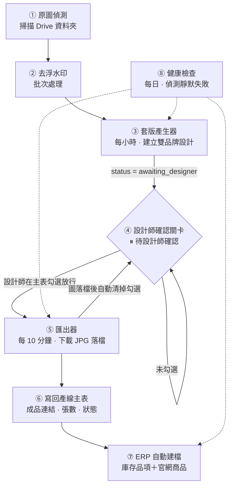

# design-ops-pipeline

**一條無人值守的商品圖產線，中間留了一道人工關卡。**
每小時掃描新到的原圖 → 自動套版成雙品牌設計 → **停下來等設計師放行** → 匯出上架圖 → 寫回 ERP 建檔。

> An unattended product-image pipeline with one deliberate human gate.
> Scans incoming raw images hourly → auto-composes designs for two brands → **stops and waits for the designer** → exports listing images → writes back to the ERP.

---

## 這條線實際跑出了什麼 · What it actually shipped

| | |
| :-- | --: |
| 上架圖產出 · Listing images produced | **1,045 張** |
| 涵蓋品項 · SKUs with output | 92（品牌 A）＋ 60（品牌 B），平均每品 **7 張** |
| 自動建檔進 ERP · SKUs auto-created in ERP | **69**（新建 40／補建 29） |
| 產線主表管理的品項 · SKUs tracked | **244** |
| 同款合併 · Cross-brand design reuse | **37 組主碼**；**55 品**用同一份設計出兩個品牌 |
| 週期性排程 · Scheduled agents | **8 支**，無人值守 |
| 上線至今 · In production since | 2026-07-30（約 4 週） |

**使用者是公司內部的設計師與採購同仁，每個工作天都在用。** 產線壞掉會有人來問。

> Users are the company's in-house designer and procurement staff. They use it every working day, and they complain when it breaks.

---

## 架構 · Architecture

三段之間**不直接呼叫**，而是透過 Drive 上的 JSON 交換區傳遞任務——因為產生設計那一側沒有寫入試算表的權限，而檔案擁有權必須落在服務帳號而不是個人帳號。

> The three stages don't call each other directly; they hand off through JSON task files in a shared Drive folder. The design-generation side has no spreadsheet write access, and file ownership has to land on the service account rather than a personal one.

---

## 為什麼要留一道人工關卡 · Why keep a human gate

自動化到最後一哩很誘人，但**版面是有品味判斷的**：字級、留白、模特兒的裁切位置，機器排得出來，排不對。所以第 ③ 段只把設計「建好、填好版」，然後停下來。

真正花時間的不是決定要不要留關卡，是**關卡放在哪裡**：

- 放在最前面（先請設計師挑圖）→ 設計師要為每一款打開一次設計工具，關卡變成瓶頸
- 放在最後面（出完圖再審）→ 圖已經落檔了，退回等於重做
- **放在第三步（設計已建好、還沒匯出）** → 設計師只需要在既有的設計上微調，改完勾一下就出圖

> Automating the last mile is tempting, but layout involves taste — type size, whitespace, where the model gets cropped. A machine can arrange it; it can't judge it. So stage ③ builds and fills the design, then stops.
>
> The hard part wasn't deciding to have a gate. It was deciding **where** to put it.

---

## 一個花了兩週才想通的設計決定 · The decision that took two weeks

**那個勾選欄的語意，是「請出圖」的一次性請求，不是「已確認過」的長期狀態。**

一開始它被當成狀態記號：設計師確認過就勾起來，代表這一款通過了。上線後撞到兩個問題：

1. **重出圖沒有入口。** 設計師改完設計想重新匯出，但勾已經是勾的了，系統看不出「他要再出一次」。
2. **另一個品牌會被搭便車。** 這一欄同時管兩個品牌。舊的勾留著，晚一步才建好的另一個品牌設計會直接繼承它被自動匯出——**設計師根本沒看過那份設計。**

改成一次性請求之後，兩個問題一起消失：圖一落檔就把勾清掉，想重出再勾一次就好。

代價是匯出器必須**連狀態已經是「完成」的列也重新檢查**，否則再勾一次不會生效。而這又帶出第三個問題——不清勾的話，那一列會每 10 分鐘被重匯一次，永遠停不下來。

> **The checkbox means "please export", not "I approved this".**
>
> It started life as a status flag. Two production problems killed that reading: there was no way to request a re-export, and the second brand's design would inherit a stale checkmark and get exported without the designer ever seeing it.

---

## 上線之後才學到的事 · What production taught us

| 症狀 | 根因 | 對策 |
| :-- | :-- | :-- |
| 排程每輪都回報成功，但表上沒有任何變化 | 輪詢在空資料夾上也計為一次「嘗試」，額度永遠用不完 | 把「什麼都沒做」跟「做了但沒結果」分開計數 |
| 補進來的新列繼承了前一個品項的狀態 | 「最後一列」只看第一欄，被清空的列被當成空列覆寫 | 補列前先清殘值，公式欄當場重新取回 |
| 合併成一組後，進度欄永遠卡在處理中 | 「已完成列數 < 同組列數」在一組只做一份時恆真 | 改變「一列一份工」的假設時，回頭掃所有數列數的公式 |
| 匯出偶爾失敗，重試也失敗 | 外部服務對「檔案還沒產生好」和「連結已過期」回同一個錯誤碼 | 用簽章有效期反推是哪一種，前者跨輪重試、後者直接重建 |

這些都寫成了測試。**測試名稱本身就是失敗模式的清單**——見 `src/` 底下的檔案說明。

> Every one of these became a test. The test names are the failure-mode list.

---

## 程式碼 · Code

| 檔案 | 內容 |
| :-- | :-- |
| [`src/designer_gate.js`](src/designer_gate.js) | 人工確認關卡的實作節錄——含「一次性請求」的完整推理 |
| [`ops/health_check.py`](ops/health_check.py) | 健康檢查節錄——怎麼分辨「排程沒動作」與「排程壞了」 |
| [`docs/decisions.md`](docs/decisions.md) | 其他關鍵決策紀錄 |

**規模與測試** ｜ 這條產線的程式碼：**生產 3,869 行 / 測試 2,393 行（62%）**，14 個測試檔，含一份手寫的 Apps Script 測試替身與 3 份 fixture。

整個自動化工作區另有 18 支 Python 工具（5,209 行）與 10 支測試（2,532 行，49%）。

> **3,869 lines of production code, 2,393 lines of tests (62%)** across 14 test files, including a hand-written Apps Script test double and 3 fixtures.

---

## 關於這份程式碼 · About this repository

這是一套**正在營運中的內部系統**的節錄，不是可以直接部署的專案。所有商業識別資訊都已移除：品牌名以「品牌 A／B」代稱、資料夾與試算表 ID 全部換成佔位符、商品品類與供應商資訊不列出。保留的是**架構、決策與失敗模式**。

節錄的程式碼可以讀，但不能跑——它依賴的試算表結構與外部服務都不在這裡。

> Excerpts from a live internal system, not a deployable project. All commercial identifiers have been removed. What remains is the architecture, the decisions, and the failure modes.
